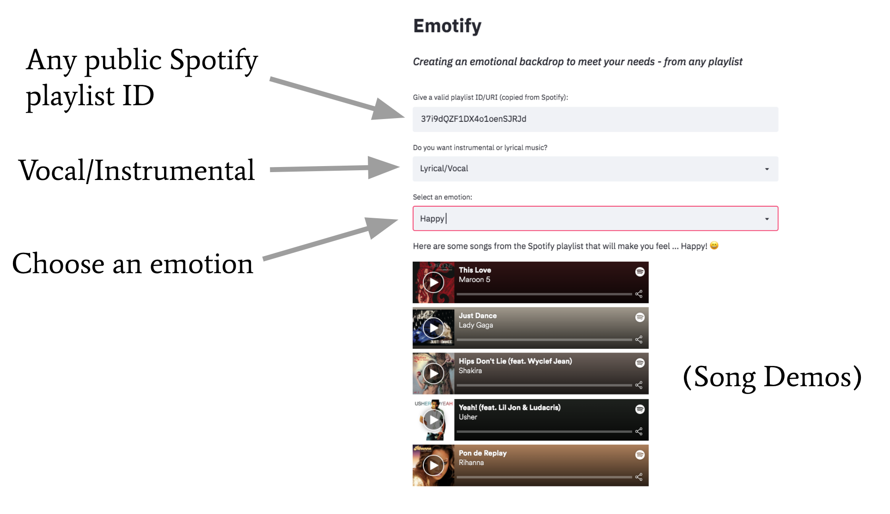
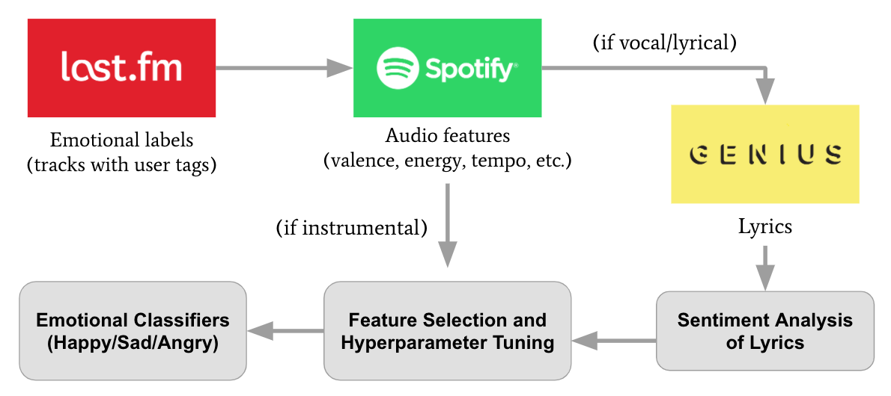

# Emotify

*Creating an Emotional Backdrop to Meet Your Musical Needs*

This repository holds the code used for model building and development of my Insight project: Emotify!

For details and code for the deployment of the actual Streamlit application, see [this repo](https://github.com/jecutter/Emotify_App).

To try out the app, visit the [application website](http://dataproject.xyz/).

See [here](http://slides.dataproject.xyz/) for slides that summarize the project results.

## Motivation

Music streaming services bring in an enormous amount of revenue. In 2019, subscriptions *alone* brought in > $7 billion, excluding ad revenue.

Spotify, a Goliath of music streaming services, allows users to create custom playlists and provides a wide variety of pre-categorized playlists as well. Mood playlists are quite popular, however they are manually curated by humans. Can we automate this process of filtering songs by their emotional content?

Emotify is a tool for listeners and content creators to filter any songs by emotion. This is a proof-of-concept for a feature that could be implemented on a larger scale as a premium subscription service, but this application is limited to any given public playlist taken as input (see the [application website](http://dataproject.xyz/)).

## Repo Contents

* Emotify_Project_Dev.ipynb - the main Jupyter notebook for this project containing data collection, EDA, model development, and validation (with the sections ordered in time, showing project development)
* build_final_model.py - a separate Python script run specifically to build final models within specific environments (with parameters tuned in the development notebook)
* Data/ - folder containing combined musical data resulting from many hours of scraping and cleaning from various data sources (see below)
* img/ - folder containing project images

## Data Sources

A variety of data sources were used for this project. It was quite challenging to build up large training sets, however, since multiple APIs had to be queried for the 10,000s of songs extracted from the Last.fm dataset.

The MSD Last.fm dataset contains user tags for many of the tracks contained, containing valuable information about user perception. By parsing these user tags for emotional keywords, I can obtain "emotional labels" for many tracks.

The Spotify and Genius APIs are then queried for both audio features and lyrics so that we can build a model by training on the emotionally labeled data.

* Last.fm (Million Songs Dataset, SQLite databases for [track info](http://millionsongdataset.com/pages/find-song-specific-name-or-feature/) ("track_metadata.db") and [user tags](http://millionsongdataset.com/lastfm/#getting) ("lastfm_tags.db"))
* Spotify API (via [Spotipy Python library](https://spotipy.readthedocs.io/en/2.12.0/))
* Genius API (via [LyricsGenius](https://github.com/johnwmillr/LyricsGenius))

In order to access the APIs, developer accounts were set up on both Spotify and Genius. The following environment variables were then set for the API queries:
* GENIUS_API_KEY: token for querying Genius API
* SPOTIPY_CLIENT_ID: Spotify client ID (from developer account)
* SPOTIPY_CLIENT_SECRET: Spotify client secret (from developer account)

## Building the Models

The goal of this project ultimately was to build 2 separate emotional classifiers: one for instrumental music and one for vocal/lyrical music. 

Data is collected in order shown in the flow diagram below, as we build up our training set based on the tracks we emotionally labeled based on the Last.fm data.

[Spotify audio features](https://developer.spotify.com/documentation/web-api/reference/tracks/get-audio-features/) are collected for songs of all emotional classes (happy, sad, and angry), but we only query the Genius API for lyrical music. To isolate a pure sample of instrumental music, we require that a song's "speechiness" < 0.33 and "instrumentalness" > 0.45 (per Spotify's documentation and based on qualitative validation). 

I tried both the NLTK-based TextBlob library as well as the NLTK Vader library to perform sentiment analysis on each song's lyrics, but settled on the latter since it provided far better separation of the emotional classes. A sentiment score is produced for each vocal song that we could find lyrics for, and is used as an additional feature in the vocal/lyrical model.

To produce the classifier models, I do:
* Downsampling of the majority classes for the training set (happy:sad:angry ~ 4:2:1)
* 80/20 train-test split
* Attempt of multi-class logistic regression, SVM (SGD), and random forest models
* Standard scaling of input features based on the training set distributions
* Recursive feature elimination
* Hyperparameter tuning using grid search with 5-fold cross-validation

